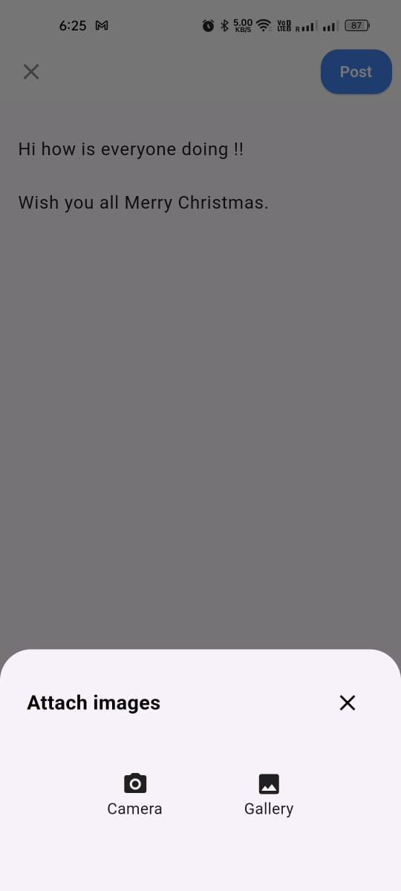
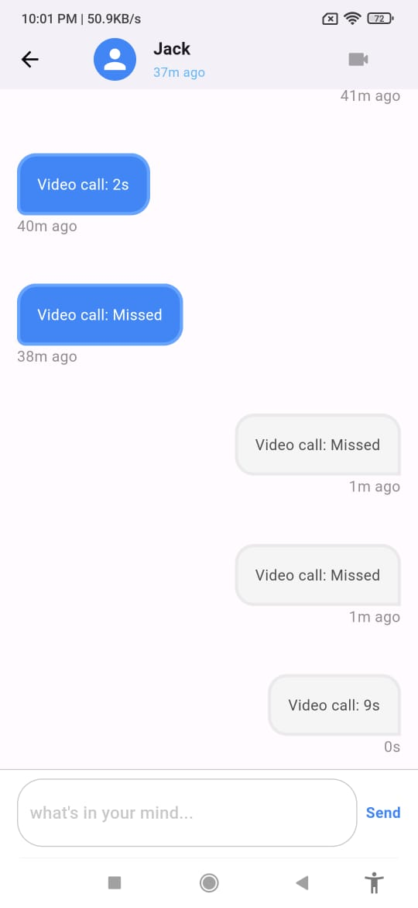

# Social Media App - Flutter Mobile App

This Flutter mobile app is part of the Social Media App project, which aims to replicate the basic functionality of a social media platform. The app utilizes the backend created with Node.js, Express, and MongoDB.

## Overview

The mobile app allows users to interact with the social media platform on the go. It provides a user-friendly interface for accessing and contributing to posts, comments, and more.

## Features

1. **User Authentication:**

   - Login and register functionalities.

2. **Upload Posts:**

   - Users can upload posts with text and images.

3. **Get All Posts:**

   - Access a feed showing all posts.

4. **View Others' Profiles:**

   - Explore other users' profiles and view their posts.

5. **Comments:**

   - Add comments on posts.

6. **Like Posts and Comments:**
   - Users can like both posts and comments.

7. **Real-time Chat:**

   - Enable real-time chat with friends.(socket.io)

8. **Video calling (P2P):**

   - Real time video calling using webRTC.

## Screens

1. **Login:**

   - User login screen.

2. **Register:**

   - User registration screen.

3. **Main Navigation:**

   - Bottom navigation bar with the following tabs:

     - **Home:** Displays all posts.
     - **Profile:** Shows the user's profile.
       - **Logout:** Log out of the app.
       - **Update Profile:** Modify user profile.

   - **Upload Post:**
     - Allows users to create and upload posts.

4. **Public Profile:**

   - Displays a user's public profile with sections for user details and their posts.

5. **Single Post View:**

   - Detailed view of a single post, including comments.

2. **Friend Requests:**

   - Send/receive friend requests.

4. **Notifications:**

   - Receive notifications for friend requests.

5. **Chat:**

   - send and receive messages to friends in real time.
   - typing and online indicators.

6 **Video call:**
   - Enable user to make video calls with friends


## Future Plans

1. **Upload Gifs, Videos, and PDFs:**

   - Enhance post content options.

2. **Privacy Settings:**

   - Make posts visible only to friends.

3. **Dark Mode:**

   - Enable real-time chat with friends.

4. **Send Media in Chats:**

   - send media files like image, videos, and other files.

5. **only Audio call:**

   - Make person to person audio calls.

6. **Add more options in Calling:**

   - Like switch camera, mute audio, stop video, etc.

7. **Replay to message:**

   - Reply to specific message.

## Getting Started

To run the Flutter mobile app in dev mode, follow these steps:

1. Clone this repository.
2. Run the following commands:

```bash
flutter pub get
flutter run --flavor dev -t lib/main_dev.dart
```

## Screeshots

|        Login Screen         |        Register Screen         |   Main Navigations(Home)   |   Main Navigations(Profile)   |
| :-------------------------: | :----------------------------: | :------------------------: | :---------------------------: |
|  |  |  |  |

|        Post Screen         |        Public Profile Screen         |        Create Post Screen         |        Create Post section         |
| :------------------------: | :----------------------------------: | :-------------------------------: | :--------------------------------: |
|  |  |  |  |

|     Edit profile Screen    |        Friends Screen         |       Friend Requests Screen      |       Friend Requests Screen       |
| :------------------------: | :---------------------------: | :-------------------------------: | :--------------------------------: |
|  |  |  |  |

|         Notification       |        Chat Screen         |       Chat Screen       |       Chat Screen       |
| :------------------------: | :---------------------------: | :-------------------------------: | :--------------------------------: |
|  |  |  |  |

|        Chat Screen        |     No Internet Screen     |        Video Call        |     Video Call       |
| :------------------------: | :------------------------: | :------------------------: | :------------------------: |
|  |  |  |  |

|         Video Call       |       Video Call        |       Video Call         |
| :------------------------: | :---------------------------: | :-------------------------------: | :--------------------------------: |
|  |  |  |

Feel free to reach out for any questions or feedback. Happy coding!
